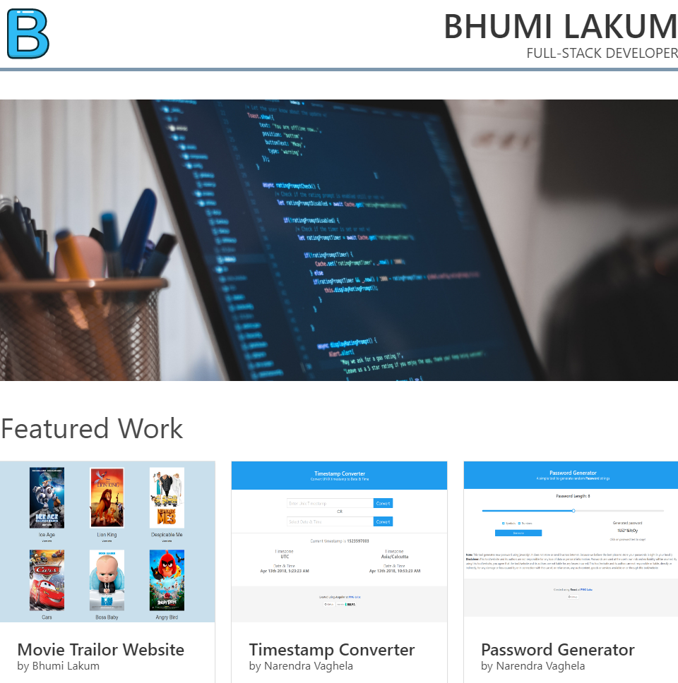

# Portfolio Website

This project is a part of [Full Stack Web Developer Nanodegree Program](https://in.udacity.com/course/full-stack-web-developer-nanodegree--nd004). This is a responsive website that will display images, descriptions, and links to each of the portfolio projects.

## Table of contents

* [Project details](#project-details)
* [Download project](#download-project)
* [Demo of project](#demo-of-project)

## Project details

This portfolio project is made using two main fundamentals, which are

1. HTML
2. CSS

Here, [BULMA CSS framework](https://bulma.io/) is used to make a site more responsive.  Bulma is an open source CSS framework based on Flexbox and built with Sass. It's 100% responsive, fully modular, and available for free.

## Download project

Download the zip file of the project to your computer or you can clone the repository. [View project](https://github.com/bhumilakum/Portfolio-site)

## Demo of project

This is a webpage of a responsive website showing details of all the portfolio projects.

